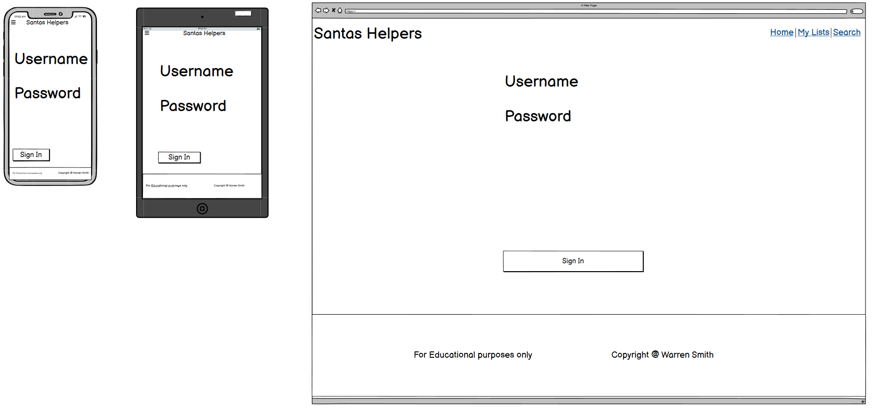
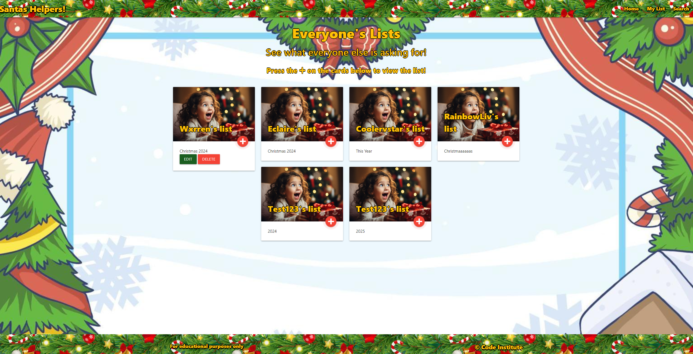

# Santas Helpers

Santas Helpers is a simple website that helps kids send their christmas letters over to santa.

User's can register to join the site and view lists created by all other users if they need some inspiration. They can also go to create and view their own lists. Users are also able to edit and delete their own lists at any time with ease!

Users can also use the search function to find the lists made by certain users by writing their username into the search bar. Parents looking to see what their kids have sent to santa will have an easy way to take a peak!

 

[You can visit the Santas Helpers website here](https://santashelpers-bddb45353cba.herokuapp.com)
------

## Table of Contents

### [User Experience (UX)](#user-experience-ux)
* #### [User Stories](#user-stories)
* #### [WireFrames](#wire-frames) (View the repository [here](https://github.com/Wxrren/win-a-car/tree/main/assets/images/wireframes))
* #### [Design](#design-1)

### [Features](#features-1)
* #### [Existing Features](#existing-features-1)
* #### [Features Left to Implement](#features-left-to-implement-1)

### [Bugs](#bugs-1)

### [Testing](#testing-1)
* #### [Validation Results](#validation-results-1)
* #### [Manual Testing](#manual-testing-1)
* #### [Lighthouse Report](#lighthouse-report-1)

### [Technologies Used](#technologies-used-1)

### [Frameworks, Libraries & Programs Used](#frameworks-libraries--programs-used-1)

### [Deployment and local development](#deployment-and-local-development-1)
* #### [GitHub Pages](#github-pages-1)
* #### [Forking the GitHub Repository](#forking-the-github-repository-1)
* #### [Local Clone](#local-clone-1)

### [Credits](#credits-1)

### [Acknowledgements](#acknowledgements-1)
------

## User Experience (UX)

There is a clear navigation in the nav bar which directs you on where to view your individual lists where you can also create your own lists. Then navbar also clearly directs you to the search function where you can search for individual users.

The website is designed to be simple so that ypung children can use it to make their christmas lists. For this reason I kept the pages plane with content central of the screen. User's card's appear in the middle of the screen with flashing + icons and instructions on the top of the page indicating to click the + to view the list. The edit and delete buttons are attached to the cards to make it easier.

To make the user experience easy - I wanted the site to have:

* A simple and easy registration and sign up form.
* A simple nav bar for children to get around the site easily.
* A simple UI. I wanted minimal buttons appearing on the screen to make it less cluttered focussing only on what they need to view lists or make their own.

## User Stories
To determine which approach to take with site features I determined the goals of different users from first time through to frequent users.

### User

* First time User Goals
    * As a user I want to understand the main purpose of the site immediately and have a fast way to get involved.
    * As a user I want to understand how I can create lists or view other peoples easily.
    * As a user I want to be able to easily navigate the site.
    
* Returning User Goals
    * As a user I want to be get straight into the action and sign in easily.
    * As a user I want to be able to easily edit my lists or delete old ones.
    
* Frequent User Goals
    * As a user I want to be able to get started quickly
    * As a user I want to see a simple and easy website with no added bloat since the last attempt.

## Wire Frames

When designing this website I intended to have a very minimal design that didn't distract from the main purpose.

I chose to keep simple and clean pages and make usage of modals for viewing lists to stop users having to go back and forth to different pages for user's lists and also for deleting lists to make sure accidental deletion doesn't happen.

### Wireframe for Desktop, Tablet and Mobile.

Landing Page Wireframe.

Registration page Wireframe.

Sign in page Wireframe.

Main page Wireframe.

My lists page Wireframe.

Add/edit list page Wireframe.

Delete modal Wireframe.

Search Page Wireframe.

## Design

### Colour

The colour scheme I wanted for the website kept the theme of simple and clean. I also wanted to continue the christmas theme so I chose a series of red's, green's and amber yellow's. I used images for the navbar and footer of a christmas wreath containing those colours and a amber yellow text so that it looks like christmas lights.

For the background I chose a white page with an image of christmas trees that maintain the 3 core colours.

* Main colours used on the website:
    * Text Colour: #ffc107 - This was chosen as a nice standout colour from the greens and reds. I also aimed for it to look like christmas lights among the wreath.. 
    * Modals and button colours: #f44336, #1b5e20,  - This was to keep with the theme of christmas. It also helped represent postive or negative actions such a green for edit and red for delete.

### Typography

* For the fonts I worked with the fonts on materialise - These fonts are:
  * -apple-system
  * BlinkMacSystemFont
  * "Segoe UI"
  * Roboto
  * Oxygen-Sans
  * Ubuntu
  * Cantarell
  * "Helvetica Neue"
  * sans-serif. 
  
This covers a range of devices such as iOS, windows, android ETC.

I changed the font weight, to make it bolder and more readable. The result was a text that looked fitting for a kids christmas themed website.

### WireFrames

I created my wireframes using balsamiq wireframes. I found this simple and effective for assessing the sites appearance as it had a variety of ready available tools representing different parts of a website so I was able to design it how I envisioned it.

## Features
* View other peoples christmas lists.
* Create, view, edit and delete christmas lists of your own
* Responsive on all device sizes.

### Existing Features

#### Landing Page

* First thing you see as you open the site.
* Gives the user an idea of what the site will be like when they register with the reveal + symbol that shows a christmas list.
* Register and sign in buttons front and center so that users can get into the action quickly.

#### View every user's list

* Operates as the main homepage showing every user's list. The idea is to help potentially give people inspiration for their own lists.
* Each card has a modal that pops up revealing their list for all users to see.
* An edit and delete button so users can edit or delete their lists. This can only be done for their own lists so the buttons will not show on other users lists.
* Each list reveals the username of the user who created it and the title they chose to give the list.

#### My lists

* Displays all lists made by the user.
* Option to edit or delete their lists.
* Button to add their own lists. From here users are redirected to a form they complete their christmas list on and then submit it to the website. This is seen below here:

#### Edit Page

* Displays's previous lists answers to be edited
* Pops

#### Delete Button

* Delete button to easily allow users to discard current or old lists
* Modal pops up to avoid accidentally clicking the delete button and losing the list. 

#### Search Bar

* Allows user's to easily search for other usernames and bring up their lists.
* No user's shown until name is written. One name is searched their lists appear.

## Features Left to Implement

* Friends and interactivity
   
    * To build a community and allow familys to connect with eachother and share their lists I would like to have given users the option to add other users as a friend. I would also have liked to allow them to interact with list by liking them.

* Letter to santa

    * I would like to allow user's to have a personalised response in a letter from santa based on the responses they put in their lists.

* Super user
    * I would like a user to be a moderator of the website. This feature would include another page bringing up a list of users on the website. They can either time out or ban users if innapropriate content is posted.

    ## Bugs

| Problem         | Action           | Status  |
| ------------------------------------------------|:--------------------------------------:| -----:|
| Forms not posting to the Database.| Intial "User" class was not allowing itself to be added to database or deleted in anyway. Created a new model table called Activeuser. This allowed forms to post and user details to be saved to the database/session| Fixed |
|  Issue with nav home button taking you back to register page when pressing home button.| Home button was connected to the landing page. I wanted it to redirect to this page when not signed in but the main page when signed in. Created an if statement that checked if the username was in session. If it was it takes you to the main page and if you are not signed in you get redirected to the landing page. I also applied this if statement to the brand logo.    |   Fixed |
| Relationship not correctly setup. | Issue with the relationships being setup incorrecly so that the db was requiring the user's ID to be filled in when submitting a form. Removed all databases from PSQL and then corrected the usermodels to reflect  the lists and folders in Activeuser model so set the relationship and tie the user to the lists.|    Fixed |
| Forms not posting to DB.| Route incorrectly setup. Checked if method -- post. From here I then created variables retrieving the form data. From here I applied them to a new instance under a new variable. I then commited that variable to the session and the form posted to the database.    |    Fixed |
Multiple users being displayed instead of just the user that created the list. .| Ran a check to see if user is in session. If they are, I created a variable that checks the session. This then checks if the owner ID of the form mathces the user ID that's in session. If it does the site will display the users username on the list instead of a loop running every username|    Fixed |

## Testing

Testing consisted of using the W3C Markup and CSS Validator to go through each page of the project and validate that the code has no errors. They can be located below: 

* [W3C Markup Validator:](https://validator.w3.org/)
* [W3C CSS Validator](https://jigsaw.w3.org/css-validator/)
* [JSHint](http://jshint.com/)
* [python](https://pep8ci.herokuapp.com)

### Validation Results

HTML

CSS

Javascript

* NOTE: jshint shows undefinined variables and unused variables. These variables are actually functions that are being called elsewhere. It is also an email.js API file that jshint is not recognising. Other than this, no other errors are present.

Python Models

Python Routes

Python run

Python init

### Manual Testing

* The website was tested on Google Chrome, Opera GX and Safari browsers.
* The website was tested on a Desktop, Laptop, Tablet and x2 phones - one android and one apple.
* Google Dev tools was used to test the responsiveness of the site on different screens.

### Tests performed

| Test        | Status           | 
| ------------- |:-------------:| 
| User Registration posts to Database      | Pass | 
| User is able to sign in with the details input in the registration form   | Pass      |
| Modals pop up on screen when buttons are pressed or conditions such as editing or deleting lists | Pass      |
| Site works correctly on Android mobile device. | Pass      |
| Site works correctly on Apple mobile device. | Pass      |
| Site works correctly on Apple tablet device. | Pass      |
| Users can view, created, update and delete forms| Pass      |
| Users can search for other users regardless of capital letters | Pass      |

--- 

### Lighthouse Report

* Mobile Results

Home Page

* Desktop Results

Home Page

## Technologies Used

* [HTML5](https://en.wikipedia.org/wiki/HTML5)
* [CSS3](https://en.wikipedia.org/wiki/CSS)
* [Javascript](https://en.wikipedia.org/wiki/JavaScript)
* [Python](https://en.wikipedia.org/wiki/Python_(programming_language))
* [PostgreSQL](https://en.wikipedia.org/wiki/PostgreSQL)

## Frameworks, Libraries & Programs Used

* [Visual Studio Code](https://code.visualstudio.com) 
    * Used to write the code/README.

* [Git](https://git-scm.com)
    *  Tracking changes in my course code and pushing them to github.

* [Github](https://github.com)
    * To store my code/files and deploy my website.

* [Google Fonts](https://fonts.google.com)
    * Used for importing my main font for the website

* [Bootstrap 5](https://getbootstrap.com/docs/5.0/getting-started/introduction/)
    * Used for making web development faster. My usage was for card columns + forms.

* [Icons8](https://icons8.com/icons)
    * Hamburger icon for mobile Nav bar toggler.

* [Am I Responsive](https://ui.dev/amiresponsive)
    * Mock picture for README file.

* [Materialize](https://materializecss.com/typography.html)
    * Used for making web development faster. My usage was for card columns + forms

## Deployment and local Development.

### Relational Database Management System

This project uses [PostgreSQL](https://www.postgresql.org) for the relationable database management system.

* To obtain your database to apply online first you had to go to [PostgreSQL](https://dbs.ci.net)
* Enter your email address and hit submit. From here your database will be created and emailed to you.

### Heroku

This project uses Heroku to build, run, and operate applications entirely in the cloud.

To achieve this you have to:

* Generate the requirements.txt file with the following command in the terminal. After you run this command a new file called requirements.txt should appear in your root directory.

* Heroku requires a Procfile containing a command to run your program. Inside the root directory of your project create the new file. It must be called Procfile with a capital P, otherwise Heroku won’t recognise it. Inside the file, add the following command

* To ensure that SQLAlchemy can also read our external database, its URL needs to start with “postgresql://”, but we should not change this in the environment variable. Instead, we’ll make an addition to our else statement from the previous step to adjust our DATABASE_URL in case it starts with postgres://:

*  ### Heroku Deployment

I used heroku to deploy the live site database. To do this I had to:

* Log into Heroku.com and click “New” and then “Create a new app”
* Choose a unique name for your app, select the region closest to you and click “Create app”
* Go to the Settings tab of your new app and click reveal config vars.
* Add each of your other environment variables except DEVELOPMENT and DB_URL from the env.py file as a Config Var. The result should look something like this:

* Login to github, earch for your repo and click Connect.
* Now, we have our project in place, It's tiome to take place adding tables to the database. Hit more then run console.

* Type python3 into the console and click Run
* once loaded type:  from santashelpers import db to imports our database. 
Once this loads type: - db.create_all().

### Github 

1.  Log in to GitHub and locate the GitHub santashelpers [Repository](https://github.com/Wxrren/Santas-Helpers)
2.  Locate the "Settings" button at the top of the repository as shown here:

This project can be cloned or forked in order to make a local copy on your own system.

For either method, you will need to install any applicable packages found within the requirements.txt file.

pip3 install -r requirements.txt.

#### How to Fork
Make a copy of the original [Repository](https://github.com/Wxrren/Santas-Helpers) on my GitHub account to view and/or make changes without affecting the original owner's repository. You can fork this repository by using the following steps:

* Log in to GitHub and locate the GitHub Repository
* At the top of the Repository (not top of page) just above the "Settings" Button on the menu, locate the "Fork" Button.
* Once clicked, you should now have a copy of the original repository in your own GitHub account!

#### How to Clone

You can clone the repository by following these steps:

* Go to the GitHub [Repository](https://github.com/Wxrren/Santas-Helpers)
* Locate the Code button above the list of files and click it
* Select if you prefer to clone using HTTPS, SSH, or GitHub CLI and click the copy button to copy the URL to your clipboard
* Open Git shell or Terminal
* Change the current working directory to the one where you want the cloned directory
* In your IDE Terminal, type the following command to clone my [Repository](https://github.com/Wxrren/Santas-Helpers)

Press Enter to create your local clone.
## Credits

### Images:

* Little girl smiling [craiyon](https://pics.craiyon.com/2023-10-08/2a6772ad003a49428d61e31b24dc3927.webp)
* Background [vecteezy](https://static.vecteezy.com/system/resources/previews/013/442/432/non_2x/christmas-winter-border-background-free-vector.jpg)
* Navbar [dreamstime](https://thumbs.dreamstime.com/b/abstract-holiday-new-year-merry-christmas-border-transparent-background-vector-illustration-eps-130860708.jpg)
* Modals [craiyon.com](https://pics.craiyon.com/2023-10-08/2a6772ad003a49428d61e31b24dc3927.webp)

### Content and Resources

* All content was written by myself.
* Information on splitting lists in python [Stackoverflow](https://stackoverflow.com/questions/20511581/split-and-strip-elements-in-list-python). I used some advise from here to split my lists so they are separated by new lines.
* Information on flexbox was provided by: [Complete Guide to Flexbox](https://css-tricks.com/snippets/css/a-guide-to-flexbox/).
* Information on CSS Grid was provided by: [Complete Guide Grid](https://css-tricks.com/snippets/css/complete-guide-grid/).
* README Template provided by [Code Institute](https://github.com/Code-Institute-Solutions/SampleREADME) & [Markdown Template](https://github.com/adam-p/markdown-here/wiki/Markdown-Cheatsheet#tables).
* Materialize was used to help with the card columns + forms. I used [materializecss.com](https://materializecss.com/getting-started.html).
* Case sensitive search function: [stackoverflow](https://stackoverflow.com/questions/16573095/case-insensitive-flask-sqlalchemy-query) - I used some information from here to help assist my search function. I learned about iLike which helps when target args.

* I created this project inline with the course content of [Code Institure](https://codeinstitute.net/full-stack-software-development-diploma/?utm_term=code%20institute&utm_campaign=CI+-+UK+-+Search+-+Brand&utm_source=adwords&utm_medium=ppc&hsa_acc=8983321581&hsa_cam=1578649861&hsa_grp=62188641240&hsa_ad=635720257674&hsa_src=g&hsa_tgt=kwd-319867646331&hsa_kw=code%20institute&hsa_mt=e&hsa_net=adwords&hsa_ver=3&gad_source=1&gclid=Cj0KCQiAwP6sBhDAARIsAPfK_wZpFDXlxByAgIRT2S39rCz7auVaNWgJ2FF7efFEtX-oT-_qhvkTSiIaApIBEALw_wcB)

## Acknowledgements

* My mentor Mitko Bachvarov for providing helpful feedback and a link to CSS modals guides on W3 schools.
* Emily for her support during the project process, assistance with testing and advice on the written portion.
* Ethan and Olivia for their support with testing the site is working as intended.